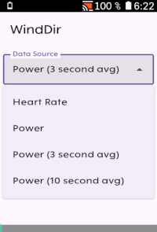

# Karoo Powerbar Extension

Simple karoo extension that shows an overlay progress bar at the edge of the screen, comparable to the
dedicated LEDs featured on Wahoo devices.

Compatible with Karoo 2 and Karoo 3 devices.

## Usage

Install the app and start it from the main menu. You will be asked to grant it permission to show 
it on top of other apps (i. e. the karoo ride app). You can select one of the following data sources
to be displayed at the bottom or at the top of the screen:

- Power
- Heart rate
- Average power over the last 3 seconds
- Average power over the last 10 seconds
- Speed
- Cadence
- Grade
- Route Progress (shows currently ridden distance)
- Remaining Route (shows remaining distance to the end of the route)

Subsequently, the bar(s) will be shown when riding. Bars are filled and colored according
to your current power output / heart rate zone as setup in your Karoo settings. Optionally, the actual data value can be displayed on top of the bar.

## Installation

This extension is available as part of the extension library on your Karoo device. More information is available in the [Hammerhead FAQ](https://support.hammerhead.io/hc/en-us/articles/34676015530907-Karoo-OS-Extensions-Library).

## Credits

- Icons by [boxicons.com](https://boxicons.com) (MIT-licensed).
- Based on [karoo-ext](https://github.com/hammerheadnav/karoo-ext) (Apache 2.0-licensed).

## Extension developers: Hide powerbar from other apps

If you are an extension developer and want to temporarily hide the powerbar when you show something on the screen
that would be hidden by the bar overlay, you can send a `de.timklge.HIDE_POWERBAR` broadcast intent to the app.
Optionally, include the following extras:

- `duration` (long, ms): Duration for which the powerbar should be hidden. If not set, the powerbar will be hidden for 15 seconds.
- `location` (string, `"top"` or `"bottom"`): Location of the powerbar to hide. If not set, the powerbar at the top will be hidden.
