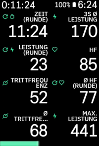

# Karoo Powerbar Extension

Simple karoo extension that shows an overlay power bar at the edge of the screen. For Karoo 2 and Karoo 3 devices.

## Usage

Install the app and start it from the main menu. You will be asked to grant it permission to show 
it on top of other apps (i. e. the karoo ride app). You can select one of the following data sources
to be displayed at the bottom or at the top of the screen:

- Power
- Heart rate
- Average power over the last 3 seconds
- Average power over the last 10 seconds
- Speed
- Cadence

Subsequently, the bar(s) will be shown when riding. Bars are filled and colored according
to your current power output / heart rate zone as setup in your Karoo settings. Optionally, the actual data value can be displayed on top of the bar.

## Installation

If you are using a Karoo 3, you can use [Hammerhead's sideloading procedure](https://support.hammerhead.io/hc/en-us/articles/31576497036827-Companion-App-Sideloading) to install the app:

1. Open the [releases page](https://github.com/timklge/karoo-powerbar/releases) on your phone's browser, long-press the `app-release.apk` link and share it with the Hammerhead Companion app.
2. Your karoo should show an info screen about the app now. Press "Install".

If you are using a Karoo 2, you can use manual sideloading:

1. Download the apk from the [releases page](https://github.com/timklge/karoo-powerbar/releases) (or build it from source)
2. Set up your Karoo for sideloading. DC Rainmaker has a great [step-by-step guide](https://www.dcrainmaker.com/2021/02/how-to-sideload-android-apps-on-your-hammerhead-karoo-1-karoo-2.html).
3. Install the app by running `adb install app-release.apk`.

## Credits

- Icons by [boxicons.com](https://boxicons.com) (MIT-licensed).
- Based on [karoo-ext](https://github.com/hammerheadnav/karoo-ext) (Apache 2.0-licensed).

## Hide powerbar from other apps

If you want to temporarily hide the powerbar from other apps when you show something on the screen
that would be hidden by the bar overlay, you can send a `de.timklge.HIDE_POWERBAR` broadcast intent to the app.
Optionally, include the following extras:

- `duration` (long, ms): Duration for which the powerbar should be hidden. If not set, the powerbar will be hidden for 15 seconds.
- `location` (string, `"top"` or `"bottom"`): Location of the powerbar to hide. If not set, the powerbar at the top will be hidden.
